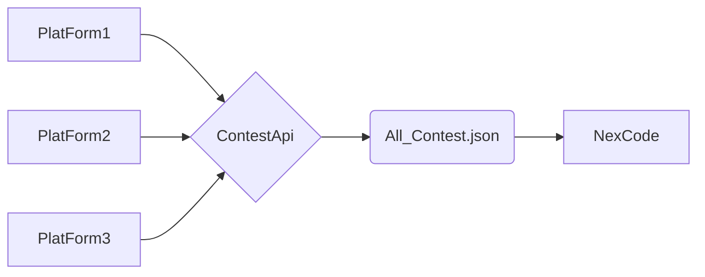

# Welcome To Contest Aggregation

Hi, I am Distracted-Explorer and i have created this Repo to use it in my very own app.
> I did not find any better name in the beginning or now hence the name Contestapi

# How You can help

If you wish any platform which is not in it you can follow these steps
- create a folder of the name of **Platform**
```bash
import requests
import json
from datetime import datetime, timezone
from bs4 import BeautifulSoup
from datetime import datetime, timezone

Leetcode=[]
headers = {"User-Agent": "Mozilla/5.0"}
utc_time =  int(datetime.now(timezone.utc).timestamp())

#Changes with platform part

# LEETCODE
query = {
 "query": """
 query {
  allContests {
	title
	titleSlug
	startTime
	duration
	}
 }
 """
}

lc = requests.post(
    "https://leetcode.com/graphql",
    json=query,
    headers=headers,
    timeout=10
).json()

for c in lc["data"]["allContests"]:
    if utc_time<c["startTime"]+c["duration"]:
        Leetcode.append({
            "platform": "LeetCode",
            "name": c["title"],
            "startTime": c["startTime"],
            "duration": c["duration"],
            "url": f"https://leetcode.com/contest/{c['titleSlug']}"
        })

# Do not Change Part

AllContests = []

with  open("../AllContest.json", "r") as f:
TempContest=json.load(f)

AllValidContest=[]

for contest in TempContest:
    if contest["platform"] is  not  "Leetcode" :
        utc_time =  int(datetime.now(timezone.utc).timestamp())
        old_contest_cutoff=utc_time-(3*24*3600)
        if old_contest_cutoff<contest['startTime']:
            AllValidContest.append(contest)

AllContests.append(AllValidContest)
AllContests.append(Leetcode)

with  open("../AllContest.json", "w") as f:
json.dump(AllContests, f, indent=2)

```
- Add this in .yml file in steps
~~~
- name: Run LeetCode fetcher
  id: LeetCode
  run: python LeetCode.py
  continue-on-error: true

- name: Notify LeetCode failure
  if: steps.LeetCode.outcome == 'failure'
  run: echo "LeetCode scraper failed!"
~~~

$Make sure the name  of Platform is Same every where (Case Sensitive)$

## Flow Chart



### Working
-> The Github Action runs every 2hr 
-> and follows steps written in it
-> Creates VM 
-> Install Dependencies
-> Run Every .py file mentioned 
-> Update AllContest.json file.
