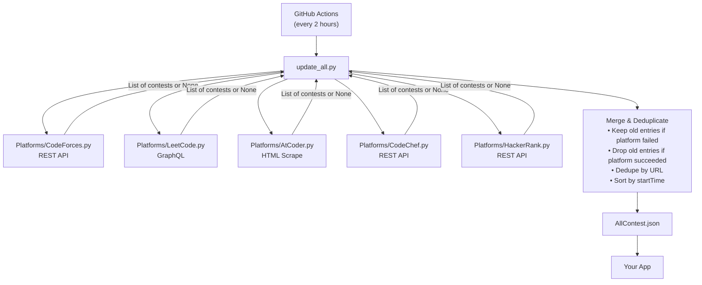
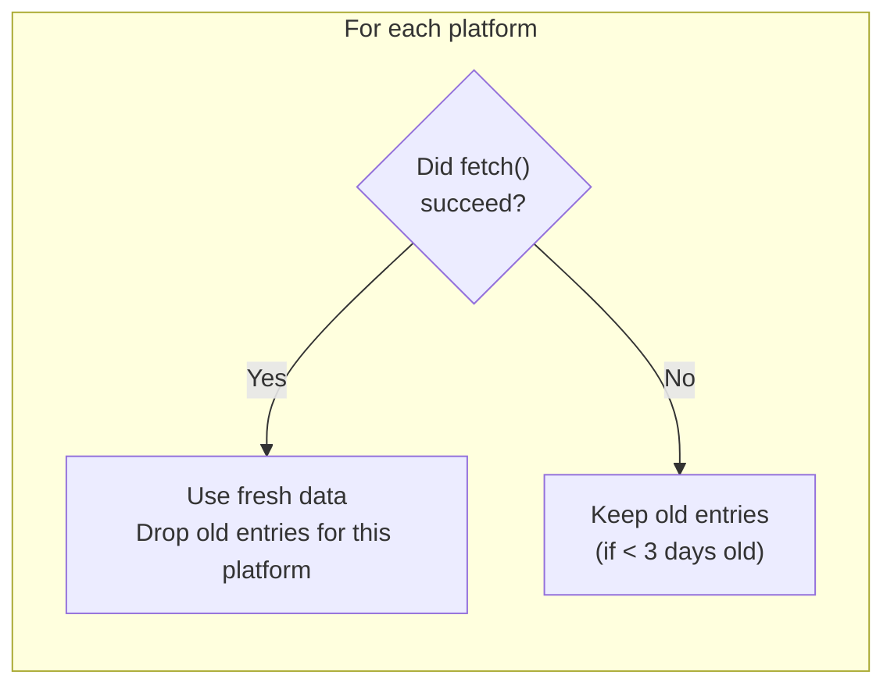

# Wecome To Contest API
> I coudn't think of a good name then and now so Contest API

A self-updating aggregator that collects upcoming and live competitive programming contests from multiple platforms and exposes them as a single JSON file — refreshed automatically every 2 hours via GitHub Actions.

>If you use this in your project, a star is appreciated!

---

##  Table of Contents

- [Wecome To Contest API](#wecome-to-contest-api)
  - [Table of Contents](#table-of-contents)
  - [What It Does](#what-it-does)
  - [Supported Platforms](#supported-platforms)
  - [Repository Structure](#repository-structure)
  - [How It Works](#how-it-works)
    - [System Flow](#system-flow)
    - [Platform Fetcher Contract](#platform-fetcher-contract)
    - [Merge Strategy](#merge-strategy)
    - [Time Window](#time-window)
  - [The Data Format](#the-data-format)
  - [Consuming the API](#consuming-the-api)
  - [Contributing — Adding a New Platform](#contributing--adding-a-new-platform)
    - [Step 1 — Create `Platforms/<PlatformName>.py`](#step-1--create-platformsplatformnamepy)
    - [Step 2 — Register the fetcher in `update_all.py`](#step-2--register-the-fetcher-in-update_allpy)
    - [Step 3 — Add a logo to `Logos/`](#step-3--add-a-logo-to-logos)
    - [Step 4 — Open a Pull Request](#step-4--open-a-pull-request)
  - [Constraints \& Design Decisions](#constraints--design-decisions)
  - [Local Development](#local-development)
  - [License](#license)

---

## What It Does

Every 2 hours, a GitHub Actions workflow:
1. Spins up a fresh Ubuntu runner
2. Runs each platform scraper in `Platforms/`
3. Merges results with existing data (preserving stale entries for any platform that failed)
4. Deduplicates by URL and sorts by start time
5. Writes the final list to `AllContest.json` and commits it back to the repo

The output is a raw JSON file you can `fetch()` directly from any app.

---

## Supported Platforms


| Codeforces|LeetCode| AtCoder| CodeChef | HackerRank |
|---|---|---|---|---|

Platform SVG logos are stored in `Logos/<Platform>.json` for convenience — each file contains the platform name, an inline SVG string, and a `tint` boolean.

---

## Repository Structure

```
contest-api/
│
├── AllContest.json          # ← The output. Fetch this in your app.
├── update_all.py            # Central orchestrator — the only script you run
├── requirements.txt         # Python deps (requests, beautifulsoup4)
│
├── Platforms/               # One file per platform
│   ├── AtCoder.py
│   ├── CodeChef.py
│   ├── CodeForces.py
│   ├── HackerRank.py
│   └── LeetCode.py
│
├── Logos/                   # Inline SVG logos for each platform
│   ├── AtCoder.json
│   ├── CodeChef.json
│   ├── CodeForces.json
│   ├── HackerRank.json
│   └── LeetCode.json
│
└── .github/
    └── workflows/
        └── update.yml       # GitHub Actions: runs every 2 hours
```

---

## How It Works

### System Flow



### Platform Fetcher Contract

Every file in `Platforms/` must export a single `fetch()` function with this signature:

```python
def fetch() -> list[dict] | None:
    # Returns a list of contest dicts on success
    # Returns None (implicitly, via exception) on failure
    ...
```

Each contest dict must have these exact keys:

| Key | Type | Description |
|---|---|---|
| `platform` | `str` | Platform name (must match the file name, case-sensitive) |
| `name` | `str` | Human-readable contest name |
| `startTime` | `int` | Unix timestamp (UTC) of contest start |
| `duration` | `int` | Duration in **seconds** |
| `url` | `str` | Direct link to the contest page |

### Merge Strategy



This means a single scraper going down doesn't wipe previously-fetched data.

### Time Window

| Platform | Window Logic |
|---|---|
| Codeforces, AtCoder, CodeChef | Show contests starting within **14 days** and not yet ended |
| LeetCode | Show all contests not yet ended |
| HackerRank | Show upcoming contests not yet started, within **14 days** |
| Stale entry cutoff | Entries older than **3 days** past their start time are dropped on next run |

---

## The Data Format

`AllContest.json` is a flat JSON array, sorted ascending by `startTime`.

```json
[
  {
    "platform": "LeetCode",
    "name": "Weekly Contest 400",
    "startTime": 1714800000,
    "duration": 5400,
    "url": "https://leetcode.com/contest/weekly-contest-400"
  },
  {
    "platform": "CodeForces",
    "name": "Codeforces Round 942 (Div. 1)",
    "startTime": 1714900000,
    "duration": 7200,
    "url": "https://codeforces.com/contestRegistration/1942"
  }
]
```

---

## Consuming the API

Point your app at the raw `AllContest.json` URL:

```
https://raw.githubusercontent.com/<your-username>/contest-api/main/AllContest.json
```

**JavaScript example:**

```js
const res = await fetch(
  "https://raw.githubusercontent.com/<your-username>/contest-api/main/AllContest.json"
);
const contests = await res.json();

// Filter to only upcoming contests
const now = Math.floor(Date.now() / 1000);
const upcoming = contests.filter(c => c.startTime > now);
```

**Derived fields you may want to compute client-side:**

```js
const contest = contests[0];

// End time
const endTime = contest.startTime + contest.duration;

// Is it live right now?
const isLive = now >= contest.startTime && now < endTime;

// Duration in hours
const hours = contest.duration / 3600;
```

---

## Contributing — Adding a New Platform

### Step 1 — Create `Platforms/<PlatformName>.py`

The file must export a `fetch()` function. Use this template:

```python
import requests
from datetime import datetime, timezone


def fetch():
    contests = []
    headers = {"User-Agent": "Mozilla/5.0"}
    utc_time = int(datetime.now(timezone.utc).timestamp())
    window = utc_time + 14 * 24 * 3600  # 14-day lookahead

    try:
        # --- Replace everything in this block ---
        data = requests.get(
            "https://example-platform.com/api/contests",
            headers=headers,
            timeout=10
        ).json()

        for c in data.get("contests", []):
            start = c["start_timestamp"]        # Unix seconds
            duration = c["duration_seconds"]
            if utc_time < start + duration and window >= start:
                contests.append({
                    "platform": "ExamplePlatform",   # Must match filename exactly
                    "name": c["title"],
                    "startTime": start,
                    "duration": duration,
                    "url": f"https://example-platform.com/contests/{c['id']}"
                })
        # --- End of platform-specific block ---

        print(f"[ExamplePlatform] Fetched {len(contests)} contests.")
    except Exception as e:
        print(f"[ExamplePlatform] FAILED: {e}")

    return contests
```

> **Important:** Never raise exceptions — catch them and return whatever you have (even an empty list). A `None` return tells the orchestrator the fetch failed and it will preserve old data instead.

### Step 2 — Register the fetcher in `update_all.py`

Add two lines:

```python
# At the top with the other imports:
import ExamplePlatform

# In the PLATFORMS dict:
PLATFORMS = {
    "AtCoder":         AtCoder.fetch,
    "CodeChef":        CodeChef.fetch,
    "CodeForces":      CodeForces.fetch,
    "HackerRank":      HackerRank.fetch,
    "LeetCode":        LeetCode.fetch,
    "ExamplePlatform": ExamplePlatform.fetch,   # ← add this
}
```

### Step 3 — Add a logo to `Logos/`

Create `Logos/ExamplePlatform.json`:

```json
{
  "platform": "ExamplePlatform",
  "svg": "<svg ...your inline SVG here...></svg>",
  "tint": false
}
```

Set `"tint": true` if the SVG is a monochrome shape that should be colorized by the consuming app.

### Step 4 — Open a Pull Request

- Title format: `feat: add ExamplePlatform scraper`
- Verify the script runs locally without errors: `python update_all.py`
- Confirm `AllContest.json` contains your platform's contests after the run

---

## Constraints & Design Decisions

| Constraint | Reason |
|---|---|
| **No external database** | `AllContest.json` in the repo is the entire data store — zero infrastructure needed |
| **Each `fetch()` is independent** | A broken scraper can't crash the others; failures are isolated by try/except |
| **Platform name must be consistent** | The merge logic keys on `contest["platform"]` matching the dict key in `PLATFORMS` — a mismatch means old entries are never cleaned up |
| **`update_all.py` owns the write** | Previously each script read+wrote `AllContest.json` itself, causing race conditions and data loss. Now only the orchestrator writes, once, at the end |
| **URL is the deduplication key** | URLs are stable and unique per contest; using names would cause duplicates across refreshes |
| **14-day lookahead window** | Keeps the file small enough for a direct browser `fetch()` without pagination |
| **3-day stale cutoff** | Old contests are kept briefly after they end (useful if a downstream app hasn't refreshed yet) |

---

## Local Development

```bash
# Clone
git clone https://github.com/<your-username>/contest-api.git
cd contest-api

# Install deps
pip install -r requirements.txt

# Run the full pipeline
python update_all.py

# Check the output
cat AllContest.json
```

The GitHub Actions workflow (`update.yml`) runs the exact same `python update_all.py` command, so local output should match what the CI produces.

You can also trigger a manual run from the **Actions** tab on GitHub → select **Update Contests** → click **Run workflow**.

---

## License

MIT — use it however you like. Attribution appreciated but not required.
